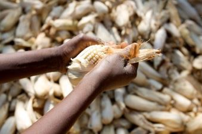

# food-security

Script to produce indicators of food security. Indicators include FAO food security metrics, distance to market, and monthly rainfall. 

Improving food security is listed as a primary sustainable development goal by the United Nations; yet, easily accessible, timely information on indicators of food securityis often difficult to obtain. This tool helps users better identify locations of vulnerable populations regarding food security. It is anticipated that this tool will prove valuable in the efforts of researchers and policy-makers to address global sustainable development challenges.

The food security tool is a modular component of the [Telecoupling Toolbox](https://github.com/MSU-CSIS/telecoupling-toolbox "Telecoupling Toolbox").
